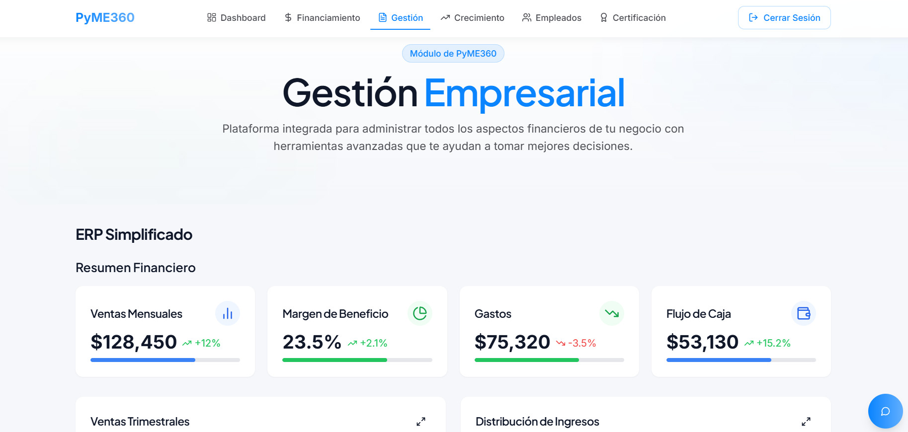

# UAB_HACKATHON

## Solución de Porks In Paris para el reto de PayRetailers

### Contexto: La fragilidad de las PyMEs en Latinoamérica

Las micro, pequeñas y medianas empresas (PyMEs) representan el 99% del tejido empresarial en Latinoamérica y generan alrededor del 61% del empleo formal. A pesar de su importancia, su contribución al PIB es solo del 25%, en comparación con el 56% en la Unión Europea. Esto refleja problemas estructurales como baja productividad, alta informalidad y dificultades para insertarse en cadenas de valor y mercados internacionales. Además, el 50% de las PyMEs desaparece en sus primeros dos años de existencia.

### Problemas estructurales de las PyMEs en la región

De acuerdo con el informe de la CEPAL, las PyMEs enfrentan diversos desafíos:

- **Falta de acceso a financiamiento:** Dificultades para obtener crédito por falta de garantías y altas tasas de interés.
- **Baja digitalización y tecnología obsoleta:** Muchas PyMEs operan con tecnología desactualizada y sin acceso a herramientas digitales.
- **Desconexión con cadenas productivas:** Pocas logran integrarse en redes de proveedores o exportar, limitando su crecimiento.
- **Fragmentación del apoyo institucional:** Las políticas de fomento son dispersas y carecen de coordinación y evaluación de impacto.

### Nuestra Solución: Plataforma de IA Responsable para PyMEs

Para abordar estos desafíos, proponemos una plataforma basada en inteligencia artificial (IA) responsable que brinde apoyo estratégico a las PyMEs mediante:

#### 1. Acceso a financiamiento inteligente

La IA analiza datos financieros y operativos de las PyMEs para generar perfiles de riesgo más precisos, permitiendo que bancos e inversores ofrezcan créditos con condiciones adaptadas a cada empresa.

#### 2. Gestión empresarial y digitalización

La plataforma ofrece herramientas para la automatización, análisis de datos y apoyo en la toma de decisiones, con el objetivo de mejorar la eficiencia y competitividad de las PyMEs.

#### 3. Crecimiento y escalabilidad, predicción de KPIs, tendencias de mercado, análisis de datos y búsqueda de empleados

A través de modelos inteligentes , ayudamos a las PyMEs a identificar oportunidades de negocio, predecir KPIs clave, analizar tendencias de mercado y optimizar la búsqueda de empleados para fomentar su crecimiento y escalabilidad.

#### 4. Sistema de trust score personalizado

Se ofrece un sistema de trust score personalizado que incluye la evolución histórica, distribución por categorías y otros parámetros relevantes, para proporcionar una evaluación detallada y adaptada a las necesidades de cada PyME.

#### 5. Fomento de una IA responsable y transparente

Garantizamos el uso ético de la IA, evitando sesgos algorítmicos y asegurando la protección de datos de las PyMEs.

### Impacto Esperado

El desarrollo de esta plataforma podría transformar el ecosistema de las PyMEs en Latinoamérica:

- **Reducción de la mortalidad empresarial** mediante herramientas de gestión y financiamiento adaptadas.
- **Aumento de la productividad** facilitando la digitalización e integración en mercados dinámicos.
- **Generación de empleo y crecimiento económico sostenible,** fortaleciendo a las PyMEs como motores de desarrollo.

### Conclusión

Nuestra solución basada en IA responsable tiene el potencial de transformar la realidad de las PyMEs latinoamericanas, brindándoles herramientas para mejorar su productividad, sostenibilidad y acceso a financiamiento. Con un enfoque integral y transparente, buscamos impulsar el crecimiento económico y la formalización del sector PyME en la región.

